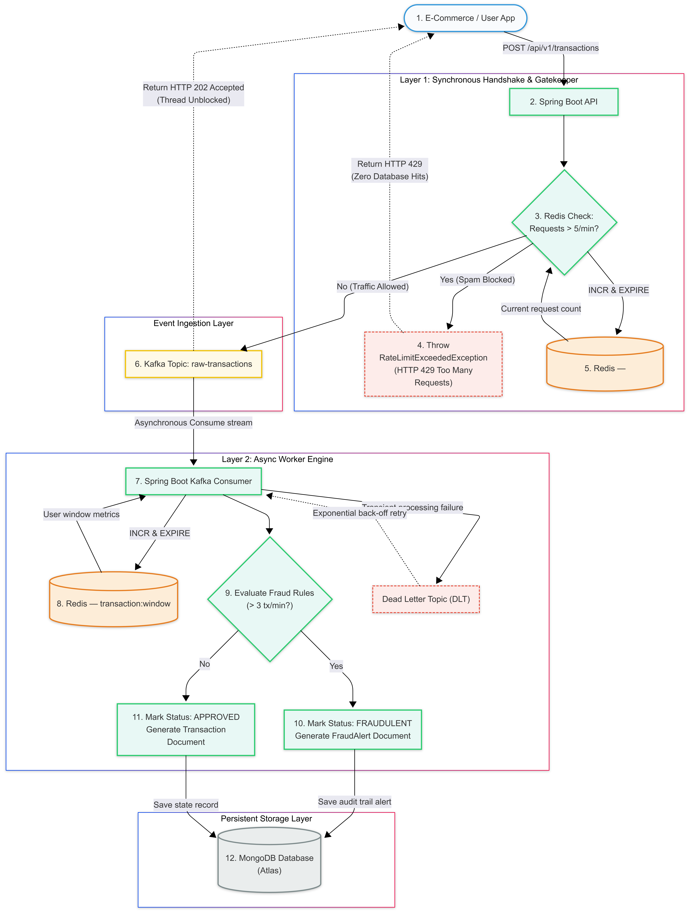

# TitanGuard — Real-Time Fraud Detection Engine


TitanGuard is an event-driven backend that evaluates financial transactions for fraud. Transactions are accepted and
queued straight away, and the fraud rules run asynchronously after that, so ingestion never waits on evaluation.

Measured at **~205 req/s with p95 400ms and zero failed requests** on a local Docker stack. See [Performance](#performance).

---

## Key Features

- **Asynchronous Processing:** Transactions are accepted via a REST API and queued for background evaluation using **Apache Kafka**. Events are keyed by user, so one user's transactions always land on the same partition and stay in order.
- **Fraud Rule Engine:** Four rules run on every transaction - velocity, high value, daily total and suspicious time window. Limits are configuration, not code.
- **Idempotent Consumption:** Kafka delivers at least once, so a Redis key marks each transaction as handled. A retry cannot count the same transaction twice.
- **Rate Limiting:** **Redis-based** per user limits on the ingestion endpoint, using an atomic counter that always carries a TTL.
- **Fault Tolerance:** Retries with exponential backoff, then a **dead letter topic**. Failed events are stored in MongoDB and can be pushed back into the pipeline with a **replay endpoint**.
- **Authentication:** **JWT** based signup and signin with role based access. The user id comes from the token, never from the request body.
- **Observability:** **Micrometer + Prometheus** metrics with a **Grafana** dashboard, and a **k6** load test in the repo.

---

## Performance

Load tested with [k6](loadtest/transactions.js) against `POST /api/v1/transactions`, with the whole stack running in
Docker on a single dev machine (Core i3 7th gen, 12 GB RAM).

| Virtual users | Throughput | p95 latency | Failed requests |
|---------------|------------|-------------|-----------------|
| 10            | 80.7 req/s | 198 ms      | 0               |
| 25            | 135.0 req/s | 317 ms     | 0               |
| 50            | **204.2 req/s** | **400 ms** | 0          |
| 100           | 209.7 req/s | 709 ms     | 0               |

**46,765 requests in total, zero failures.**

Throughput scales with load up to around 50 concurrent users. After that it flattens at roughly 205 req/s while latency
nearly doubles, so requests are queuing rather than being served any faster. 50 concurrent users is the useful operating
point on this hardware.

### How it was measured
- k6 creates a separate account for every virtual user, because the rate limiter works per user
- The rate limit is raised for the run using `RATE_LIMIT_MAX_REQUESTS`. It is a product rule, not a throughput limit,
  and leaving it at 5 would only measure the limiter
- k6 runs on the same machine as the stack, so these numbers include that contention

### What this does not measure
The API returns `202` as soon as the transaction is saved and published to Kafka. Fraud evaluation happens
asynchronously after that, and is **not** included in these numbers.

---

## Architecture Overview



TitanGuard follows a modern, event-driven microservices pattern:

1.  **Ingestion:** A Spring Boot REST API receives a transaction request.
2.  **Rate Limiting:** Redis validates the request frequency against per-user limits.
3.  **Producers:** Validated requests are published to a Kafka topic (`raw_transaction`).
4.  **Consumers:** Background workers consume transaction events and run them through the **Fraud Rule Engine**.
5.  **Rule Engine:** Evaluates transactions based on:
    *   **Velocity:** Maximum transaction count per time window.
    *   **Value:** High-value transaction thresholds.
    *   **Timing:** Transactions occurring during "suspicious" hours (e.g., 1 AM - 4 AM).
    *   **Daily Total:** Sum of a user's approved transactions in a day.
6.  **Persistence:** Final statuses and fraud alerts are stored in MongoDB.

---

## Tech Stack

| Layer                | Technology              | Purpose                                   |
|----------------------|-------------------------|-------------------------------------------|
| **Language**         | Java 21                 | Core application development              |
| **Framework**        | Spring Boot 4.x         | API Development & Kafka Orchestration     |
| **Security**         | Spring Security + JWT   | Authentication and role based access      |
| **Message Broker**   | Apache Kafka (KRaft)    | Distributed event streaming & ingestion   |
| **Cache / Tracking** | Redis                   | Rate limiting, windowing, idempotency     |
| **Database**         | MongoDB                 | Storage for transactions and fraud alerts |
| **Observability**    | Micrometer + Prometheus + Grafana | Metrics and dashboards          |
| **Load Testing**     | k6                      | Throughput and latency measurement        |
| **CI**               | GitHub Actions          | Builds the image on every pull request    |
| **Containerization** | Docker + Docker Compose | Simplified infrastructure deployment      |

---

## API Reference

Everything except `/api/v1/auth/**` needs a token. Send it as `Authorization: Bearer <token>`, or let the browser use
the `access_token` cookie that signIn sets.

### Sign Up
`POST /api/v1/auth/signUp`

Password must be 8 to 16 characters with at least one letter, one number and one symbol.

**Request Body:**
```json
{
  "email": "reon@example.com",
  "password": "Str0ng!pass"
}
```

**Response:** `201 Created`
```json
{
    "success": true,
    "message": "SignUp success",
    "data": {
        "id": "9f3c1a20-4d5e-4c11-9a77-2b8e6f0d1234",
        "email": "reon@example.com",
        "role": [ "USER" ],
        "createdOn": "2026-09-06T10:14:02.117Z"
    },
    "timestamp": "2026-09-06T10:14:02.130Z"
}
```

Returns `409 Conflict` if the email is already registered.

### Sign In
`POST /api/v1/auth/signIn`

**Request Body:**
```json
{
  "email": "reon@example.com",
  "password": "Str0ng!pass"
}
```

**Response:** `200 OK` - the token is in the body, and also set as an httpOnly cookie.
```json
{
    "success": true,
    "message": "SignIn success",
    "data": {
        "token": "eyJhbGciOiJIUzI1NiJ9...",
        "tokenType": "ACCESS",
        "expiry": 3600,
        "issuedAt": "2026-09-06T10:15:44.902Z"
    },
    "timestamp": "2026-09-06T10:15:44.910Z"
}
```

---

### Transactions Ingestion
`POST /api/v1/transactions`

**Description:** Submits a new transaction for fraud evaluation.

**Requires a valid JWT** (`Authorization: Bearer <token>`). The user is taken from the token, not the body.

**Request Body:**
```json
{
  "amount": 15000.0
}
```

**Response:** `202 Accepted`
```json
{
    "success": true,
    "message": "Transaction accepted into processing pipeline.",
    "data": {
        "transactionId": "1dd81b4a-72c4-4d65-a559-508cd6ef9a99",
        "userId": "9f3c1a20-4d5e-4c11-9a77-2b8e6f0d1234",
        "amount": 15000.0,
        "status": "PENDING"
    },
    "timestamp": "2026-05-24T05:01:41.480Z"
}
```

### My Transactions
`GET /api/v1/transactions/me?page=0&size=10`

**Description:** Returns the logged in user's transactions.

### Transaction Status
`GET /api/v1/transactions/{id}`

**Description:** Retrieves the current status of a transaction (PENDING, APPROVED, FRAUDULENT, FAILED).

**Response:** `200 OK`

### User Transactions (ADMIN)
`GET /api/v1/transactions/user/{userId}?page=0&size=10`

**Description:** Any user's transactions. Requires the ADMIN role.

### Fraud Alerts (ADMIN)
`GET /api/v1/fraud-alerts?page=0&size=10`
`GET /api/v1/fraud-alerts/user/{userId}?page=0&size=10`

**Description:** Transactions that were flagged, with the rule that flagged them.

**Response:** `200 OK`
```json
{
    "success": true,
    "message": "Fraud alerts fetched",
    "data": [
        {
            "alertId": "6b2f0e91-77aa-4c33-9f10-51d0c4a99b22",
            "targetTransactionId": "1dd81b4a-72c4-4d65-a559-508cd6ef9a99",
            "userId": "9f3c1a20-4d5e-4c11-9a77-2b8e6f0d1234",
            "reason": "High-value transaction limit exceeded.",
            "flaggedAt": "2026-09-06T10:21:07.441Z"
        }
    ],
    "timestamp": "2026-09-06T10:21:30.002Z"
}
```

### Failed Transactions (ADMIN)
`GET /api/v1/failed-transactions?page=0&size=10`

**Description:** Events that exhausted their retries and landed in the dead letter topic, kept for inspection.

### Replay a Failed Transaction (ADMIN)
`POST /api/v1/failed-transactions/{id}/replay`

**Description:** Puts a failed event back on the Kafka topic. It clears the idempotency key first, otherwise the
consumer would treat the replayed event as a duplicate and silently skip it. The transaction goes back to `PENDING`.

**Response:** `202 Accepted`

---

## ⚙️ Setup & Installation

### Prerequisites
- JDK 21+
- Docker & Docker Compose
- Maven (optional, if not using the included wrapper)

### Running with Docker Compose
1. Clone the repository.
2. Start everything (backend, Kafka, MongoDB, Redis):
   ```bash
   docker-compose up -d --build
   ```
   The API will be available on `http://localhost:8100`.

### Running the backend locally
Start only the infrastructure and run the app from your IDE or the command line:
```bash
docker-compose up -d mongodb redis kafka
cd backend
./mvnw spring-boot:run
```
The default config points to localhost, so no environment variables are needed.
To override anything, copy `.env.example` to `.env` and edit it.

### Metrics and dashboards
Prometheus scrapes the app every 15s and Grafana reads from Prometheus.

- Raw metrics: `http://localhost:8100/actuator/prometheus`
- Prometheus: `http://localhost:9090`
- Grafana: `http://localhost:3000` (admin / admin)

The Prometheus datasource is already wired up in Grafana. To get a dashboard,
go to Dashboards > New > Import and enter id **4701** (JVM Micrometer).

### Load testing
The load test needs [k6](https://k6.io/docs/get-started/installation/).

The rate limiter allows 5 requests per user per 60s, which is a product rule and not
a throughput limit, so raise it for the run otherwise everything comes back 429:

```bash
RATE_LIMIT_MAX_REQUESTS=100000 docker-compose up -d --build
k6 run loadtest/transactions.js
```

Options: `VUS` (default 20) and `DURATION` (default 60s).

```bash
k6 run -e VUS=50 -e DURATION=120s loadtest/transactions.js
```

### Running the tests
```bash
cd backend
./mvnw test
```

### Default Configuration
- **Server Port:** 8100
- **Rate Limit:** 5 requests per 60s per user (override with `RATE_LIMIT_MAX_REQUESTS`)
- **Fraud Rules (Dev):**
  - High Value Limit: > 50,000
  - Window Max Count: 3 transactions per 60s
  - Suspicious Hours: 01:00 - 04:00 UTC
  - Daily Total Limit: 50,000 (resets at 00:00 UTC)
- **Access Token Expiry:** 3600s

---

## 📂 Project Structure

- `com.reon.titan_backend.controller`: REST endpoints for transaction management.
- `com.reon.titan_backend.kafka`: Producers and consumers for event-driven flow.
- `com.reon.titan_backend.rule`: Logic for fraud detection.
- `com.reon.titan_backend.service`: Core business logic and database interactions.
- `com.reon.titan_backend.document`: MongoDB entity definitions.
- `com.reon.titan_backend.dto`: Data Transfer Objects for API and Kafka events.
